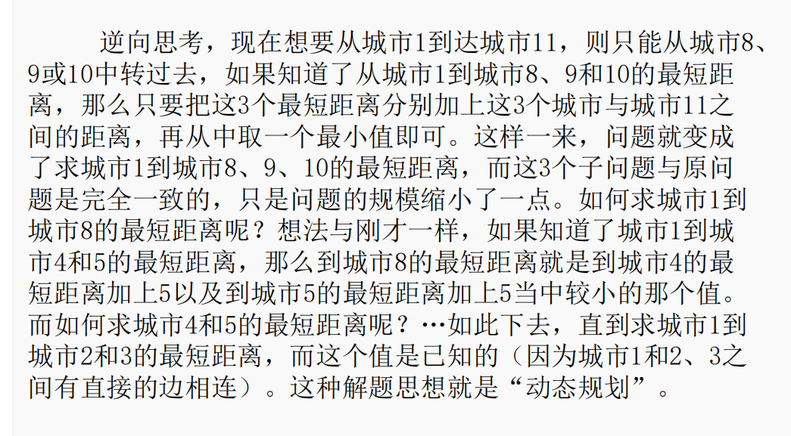

## 动态规划DP
状态转移方程  
### 国王的金矿
题目描述
国王在他的国家发现了n座金矿，为了描述方便，我们给他们从1到n编号。
对于第i个金矿，需要投入w(i）个的费用，能挖出来V(i)个单位的金子。
现在国王想开挖这些金矿，但是最多只有M个人力用于投入，问最多可以挖出来多少单位的金子。
(每个金矿只能全部挖或是不挖，不能只挖一部分）
输入样例 
5 10
3 350
5 500
5 400
4 300
3 200
输出样例 
900
```c++
#include <bits/stdc++.h>
using namespace std;
// 国王的金矿
int w[10000], c[10000];
// 对于第i个金矿，需要投入w(i）个的费用(人)，能挖出来c(i)个单位的金子。
int n, m;
int dp[100][100];
// dp[i][j] 表示前i座金矿被j个人挖掘后，可以获得的最大价值
int main()
{
    cin >> n >> m;
    // n座金矿，m个人
    for (int i = 1; i <= n; i++)
    {
        cin >> w[i] >> c[i];
    }
    // 初始化
    memset(dp, 0, sizeof(dp));
    // 递推 状态转移
    for (int i = 1; i <= n; i++)
    {
        for (int j = 1; j <= m; j++)
        {
            if (w[i] <= j)
            {
                // 所需人数够
                dp[i][j] = max(dp[i - 1][j], dp[i - 1][j - w[i]] + c[i]);
            }
            else
            {
                // 人数不够，不能进行挖掘
                dp[i][j] = dp[i - 1][j];
            }
        }
    }
    cout << dp[n][m];
}

```

### 城市交通网络图
题目描述
有 n 个城市，编号 1~n，有些城市之间有路相连，有些则没有，有路则会有一个距离。图  所示为一个含有 11 个城市的交通图，连线上的数（权）表示距离。
现在规定只能从编号小的城市到编号大的城市。问：从编号为 1 的城市到编号为n 的城市之间的最短距离是多少？
输入样例 
11
0 5 3 0 0 0 0 0 0 0 0
5 0 0 1 6 3 0 0 0 0 0
3 0 0 0 8 0 4 0 0 0 0
0 1 0 0 0 0 0 5 6 0 0
0 6 8 0 0 0 0 5 0 0 0
0 3 0 0 0 0 0 0 0 8 0
0 0 4 0 0 0 0 0 0 3 0
0 0 0 5 5 0 0 0 0 0 3
0 0 0 6 0 0 0 0 0 0 4
0 0 0 0 0 8 3 0 0 0 3
0 0 0 0 0 0 0 3 4 3 0
输出样例 
13

  

```c++
#include <bits/stdc++.h>
using namespace std;
int dp[1000];
// 表示从城市1到城市j的最短距离
int mp[1000][1000];
int main()
{
    int n;
    cin >> n;
    for (int i = 1; i <= n; i++)
    {
        for (int j = 1; j <= n; j++)
        {
            cin >> mp[i][j];
        }
    }
    for (int i = 2; i <= n; i++)
        dp[i] = 1e9;

    for (int i = 2; i <= n; i++)
    {
        for (int j = 1; j <= i; j++)
        {
            if (mp[i][j])
            // j和i之间有路可走
            {
                // 1直接到i, 1先到j再到i
                dp[i] = min(dp[i], dp[j] + mp[i][j]);
            }
        }
    }
    cout << dp[n];
}

```

### 瓶子涂色
题目描述
小猪上小学的时候，一度对颜色非常感兴趣，虽然他的美术非常糟糕。
有一次他喝完n瓶饮料把透明的瓶子排成一排，想把这些饮料瓶子都涂上颜色。他觉得如果所有相邻的两个瓶子颜色都不一样的话会比较有趣。
他现在只有红色(Red)、绿色(Green)和蓝色(Blue)这三种颜料。由于瓶子的大小和表面材质不同，在不同的瓶子上涂不同的颜色需要的花费都不一样。小猪统计了一下，把第i个瓶子染成红色需要Ri元钱，染成绿色需要Gi元钱，染成蓝色需要Bi元钱。
现在请你帮他计算出要使相邻两个瓶子的颜色都不一样，他至少需要多少花费
输入样例 
5 
1 3 1 2 2 
1 2 3 4 3 
4 2 1 5 3
输出样例 
9

```c++
#include <bits/stdc++.h>
using namespace std;
int dp[100001][3];
// 第i个瓶子涂第j种颜色所花费和最小代价
int a[100001][3];
int main()
{
    int n;
    cin >> n;
    for (int i = 1; i <= n; i++)
        cin >> a[i][0];
    for (int i = 1; i <= n; i++)
        cin >> a[i][1];
    for (int i = 1; i <= n; i++)
        cin >> a[i][2];
    for (int i = 1; i <= n; i++)
    {
        dp[i][0] = min(dp[i - 1][1] + a[i][0], dp[i - 1][2] + a[i][0]);
        dp[i][1] = min(dp[i - 1][0] + a[i][1], dp[i - 1][2] + a[i][1]);
        dp[i][2] = min(dp[i - 1][0] + a[i][2], dp[i - 1][1] + a[i][2]);
    }
    cout << min(dp[n][0], min(dp[n][1], dp[n][2]));
}


```
### 糖果
题目描述
由于在维护世界和平的事务中做出巨大贡献，Dzx被赠予糖果公司2010年5月23日当天无限量糖果免费优惠券。在这一天，Dzx可以从糖果公司的N件产品中任意选择若干件带回家享用。糖果公司的N件产品每件都包含数量不同的糖果。Dzx希望他选择的产品包含的糖果总数是K的整数倍，这样他才能平均地将糖果分给帮助他维护世界和平的伙伴们。当然，在满足这一条件的基础上，糖果总数越多越好。Dzx最多能带走多少糖果呢？
注意：Dzx只能将糖果公司的产品整件带走。
输入样例 复制
5 7
1
2
3
4
5
输出样例 复制
14

```c++
#include <bits/stdc++.h>
using namespace std;
int a[110]; // 没有空间约束，空间价值均为a[i]
int n, k;
int dp[110][110]; // 以k作为第二个空间，结果以dp[n][0]表示在n个元素都遍历过，且余数为0的情况下的最大值
// dp[][]表示执行过前i个元素中余数为j的情况下的最大值

int main()
{
    cin >> n >> k;
    for (int i = 1; i <= n; i++)
        cin >> a[i];
    memset(dp, -0x3f3f3f, sizeof(dp)); // 对于初始情况，第一次到这种情况下，原数要保证无限小，排除没有用过的元素相加，都为0的话会使所有元素都相加
    dp[0][0] = 0;
    for (int i = 1; i <= n; i++)
    {
        for (int j = 0; j < k; j++)
        {                                                                           // 对余数进行遍历
            dp[i][j] = max(dp[i - 1][j], dp[i - 1][(j - a[i] % k + k) % k] + a[i]); // 后者保证，下标恒正（0，k）
            // cout<<dp[i][j]<<" ";
        }
        // cout<<endl;
    }
    cout << dp[n][0];
    return 0;
}
```
### zz买手机

题意：给定N个数，要求找出k个不重叠且长度为m的连续区间，使他们的和最大。
思路：dp[i][j]表示到i位置时找出j组所得的最大值。

输入样例 
7 1 3
2 10 7 18 5 33 0
输出样例 
61

```c++
# include <stdio.h>
# include <string.h>
# include <algorithm>
using namespace std;
long long a[5001]={0}, dp[5001][5001];
int main()
{
    int n, m, k;
    while(~scanf("%d%d%d",&n,&m,&k))
    {
        memset(dp, 0, sizeof(dp));
        for(int i=1; i<=n; ++i)
        {
            scanf("%d",&a[i]);
            a[i] += a[i-1];
        }
        for(int i=1; i<=k; ++i)
            for(int j=i*m; j<=n; ++j)
                dp[j][i] = max(dp[j-1][i], dp[j-m][i-1] + a[j] - a[j-m]);
        printf("%I64d\n",dp[n][k]);
    }
    return 0;
}
```
### 大卖场购物车
题目描述
央视有一个大型娱乐节目—购物街，舞台上模拟超市大卖场，有很多货物，每个嘉宾分配一个购物车，可以尽情地装满购物车，购物车中装的货物价值最高者取胜。假设有 n 个 物品和 1 个购物车，每个物品 i 对应价值为 vi，重量 wi，购物车的容量为 W（你也可以将重 量设定为体积）。每个物品只有 1 件，要么装入，要么不装入，不可拆分。在购物车**不超重** 的情况下，如何选取物品装入购物车，使所装入的物品的总价值最大？最大价值是多少？装 入了哪些物品？ 
输入样例 
5
10
2 6 
5 3 
4 5 
2 4 
3 6
输出样例 
17

```c++
#include <bits/stdc++.h>
using namespace std;
int w[21],v[21];
typedef long long LL;
int dp[21][1000010];
int main(){
    int n,m;
    cin>>n>>m;
    for(int i=1;i<=n;i++)cin>>w[i]>>v[i];
    for(int i=1;i<=n;i++){
        for(int j=0;j<=m;j++){
            if(j>=w[i]){
                dp[i][j]=max(dp[i-1][j],dp[i-1][j-w[i]]+v[i]);
            }
            else dp[i][j]=dp[i-1][j];
        }
    }
    cout<<dp[n][m];
    return 0;
}  
```

### 采药
题目描述
辰辰是个天资聪颖的孩子，他的梦想是成为世界上最伟大的医师。为此，他想拜附近最有威望的医师为师。医师为了判断他的资质，给他出了一个难题。医师把他带到一个到处都是草药的山洞里对他说：“孩子，这个山洞里有一些不同的草药，采每一株都需要一些时间，每一株也有它自身的价值。我会给你一段时间，在这段时间里，你可以采到一些草药。如果你是一个聪明的孩子，你应该可以让采到的草药的总价值最大。”  
如果你是辰辰，你能完成这个任务吗？
输入样例 
70 3
71 100
69 1
1 2
输出样例 
3

```c++
#include<bits/stdc++.h>
using namespace std;
int dp[1000005];
int w[105],v[105];
int n,t;
int main()
{
    cin>>t>>n;
    for(int i=1;i<=n;i++)    
        cin>>w[i]>>v[i];
    for(int i=1;i<=n;i++)
    for(int j=t;j>=w[i];j--){
        dp[j]=max(dp[j],dp[j-w[i]]+v[i]);
 
    }
    cout<<dp[t];
    return 0;
}

```
### 集装箱装载
题目描述
有一批共n个集装箱要装上艘载重量为c的轮船，其中集装箱i的重量为wi。找出一种最优装载方案，将轮船尽可能装满，即在装载体积不受限制的情况下，将尽可能重的集装箱装上轮船。
输入样例 
5 10
7 2 6 5 4
输出样例 
10

```c++
#include <bits/stdc++.h>
using namespace std;
int n, m;
int w[100001];
int dp[1001][1001];
int main()
{
    cin >> n >> m;
    for (int i = 1; i <= n; i++)
    {
        cin >> w[i];
    }
    for (int i = 1; i <= n; i++)
    {
        for (int j = 1; j <= m; j++)
        {
            if (w[i] <= j)
            {
                dp[i][j] = max(dp[i - 1][j], dp[i - 1][j - w[i]] + w[i]);
            }
            else
            {
                dp[i][j] = dp[i - 1][j];
            }
        }
    }
    cout << dp[n][m];
    return 0;
}
```
### NASA的食物计划
题目描述
航天飞机的体积有限,当然如果载过重的物品,燃料会浪费很多钱,每件食品都有各自的体积、质量以及所含卡路里,在告诉你体积和质量的最大值的情况下,请输出能达到的食品方案所含卡路里的最大值,当然每个食品只能使用一次.
输入样例 
320 350
4
160 40 120
80 110 240
220 70 310
40 400 22
输出样例 
```c++
#include <iostream>
using namespace std;
int v[55],w[55],ca[55],n,V,W,dp[405][405];
int main()
{
    cin>>V>>W;
    cin>>n;
    for(int i=1;i<=n;i++)cin>>v[i]>>w[i]>>ca[i];
     
    for(int i=1;i<=n;i++)
    for(int j=V;j>=v[i];j--)
    for(int k=W;k>=w[i];k--)
    {
        dp[j][k]=max(dp[j][k],dp[j-v[i]][k-w[i]]+ca[i]);
    }
    cout<<dp[V][W];
}
```


 