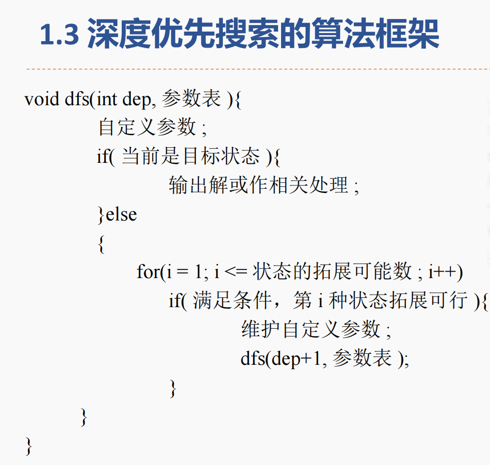
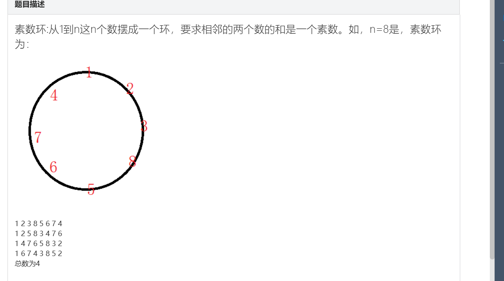
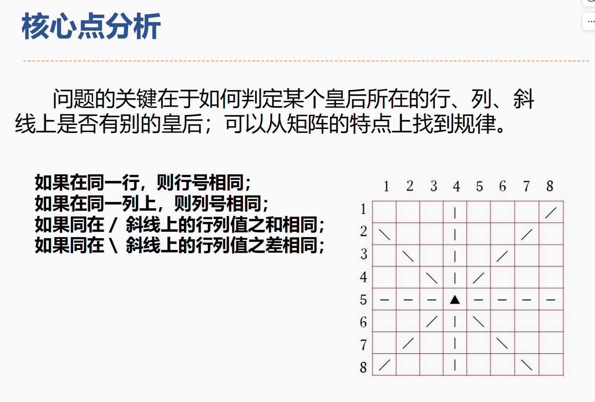

# 程序设计实训期末复习题目集锦  
## 搜索
  
### 全排列
> 题目：输出自然数1~n所有不重复的排列，即n的全排列，要求所产生的任一数字序列中不允许出现重复数字。
> 输入：
> 3
> 输出：
> 1 2 3
1 3 2
2 1 3
2 3 1
3 1 2
3 2 1
```c++
#include <bits/stdc++.h>
using namespace std;
int n;
int step[10000], book[10000];
// book[i]-记录第i号扑克牌是否在手上，0表示未放到盒子中，1表示已放到盒子中
// step[i]-step下标是盒子序号，数值是扑克牌数
void dfs(int x)
{
    // 判断边界,遍历到n+1个盒子说明前n个都放好了
    if (x == n + 1)
    {
        for (int i = 1; i <= n; i++)
        {
            printf("%d ", step[i]);
        }
        printf("\n");
        return;
    } // 返回上一层继续遍历

    for (int i = 1; i <= n; i++)
    {
        if (!book[i])
        {
            // 扑克牌还未放置
            step[x] = i;
            book[i] = 1;
            // 放置扑克牌更新状态
            dfs(x + 1);
            book[i] = 0;
            // 收回放入的扑克牌，以便正常返回
        }
    }
    return;
}
int main()
{
    cin >> n;
    dfs(1);
}
```
### 组合数
>题目：
排列与组合是常用的数学方法，其中组合就是从n个元素中抽出r个元素(不分顺序且r≤n)，我们可以简单地将n个元素理解为自然数1，2，…，n，从中任取r个数。
现要求你用递归的方法输出所有组合。
>输入：
>5 3
>输出：
>1 2 3
>1 2 4
>1 2 5
>1 3 4
>1 3 5
>1 4 5
>2 3 4
>2 3 5
>2 4 5
>3 4 5

```c++
#include <bits/stdc++.h>
using namespace std;
int n, m;
int vis[1000];
int a[10000];
void dfs(int k) // 当前枚举的位置u, 从start处开始枚举
{
    for (int i = a[k - 1]; i <= n; i++)
    {
        if (!vis[i])
        {
            a[k] = i;
            vis[i] = 1;
            if (k == m)
            {
                // 输出m位组合数
                for (int j = 1; j <= m; j++)
                {
                    printf("%d ", a[j]);
                }
                printf("\n");
            }
            else
            {
                dfs(k + 1);
            }
            vis[i] = 0;
        }
    }
}
int main()
{
    cin >> n >> m;
    a[0] = 1;
    dfs(1);
}
```

### 字母有重复全排

>题目描述:
>输出前N个字母的有重复全排列
>Sample Input
>2
>Sample Output
>AA
>AB
>BA
>BB


```c++
#include <bits/stdc++.h>
using namespace std;
int n;
// 1<= n <=10
char ch[30] = {'A', 'B', 'C', 'D', 'E', 'F', 'G', 'H', 'I', 'J'};
char a[1000];
void dfs(int k)
{
    if (k == n)
    {
        for (int i = 0; i < n; i++)
        {
            cout << a[i];
        }
        cout << endl;
    }
    else
    {
        for (int i = 0; i < n; i++)
        {
            a[k] = ch[i];
            dfs(k + 1);
        }
    }
}
int main()
{
    cin >> n;
    dfs(0);
    return 0;
}

```

###  有重复元素的排列问题 
>题目：对n个元素进行全排列。这n个元素由小写字母组成，这n个元素中的某些可能相同 
>输入：
>4 
>aacc
>输出：
>aacc
>acac
>acca
>caac
>caca
>ccaa
>6

```c++
#include <bits/stdc++.h>
using namespace std;
int n;
string s;
int cnt = 0;
char a[1000];
int b[1000]; // b[i]---字母i出现的次数
int vis[1000];
void dfs(int k)
{
    if (k == n)
    {
        for (int i = 0; i < n; i++)
        {
            printf("%c", a[i]);
        }
        cout << endl;
        cnt++;
        return;
    }
    // !将i(char)从a-z遍历
    for (char i = 'a'; i < 'z'; i++)
    {
        if (b[i])
        {
            a[k] = i;
            b[i]--;
            dfs(k + 1);
            b[i]++;
        }
    }
}
int main()
{
    cin >> n;
    cin >> s;

    for (int i = 0; i < s.length(); i++)
    {
        b[s[i]]++;
        // 记录字母出现的次数
    }

    dfs(0);
    cout << cnt;
}

```

### 泉水
题目描述
小f住在农村，离他的家不远有一口井，传说是小f的祖先开掘的。虽然小f的村子里通了自来水，但是由于这口井井水质量非常的好，因此小f仍然喝这口井里的水。小f非常喜欢这口井，所以他经常去打水。小f的家里有n（n 是偶数）只桶，这些桶虽然大小相等，但是由于很多都有些破损，所以认为它们是不同的。小f经常挑一根扁担（带两只空桶，必须是空的，且是2 只）去井边打水。小f每次去井旁都会把桶中的水装到极限（假设水量无穷，且小f都能够担得动）。设小f挑得是x、y 两只桶，则打水一趟需要走time[x,y]分钟。小f想要在最少的时间内用自己的力量把家里所有的空桶装满。小f觉得这是个难题，于是来找你帮忙。。
输入样例 
4
0 58 49 81
58 0 38 76
49 38 0 48
81 76 48 0
输出样例 
106

```c++
#include <bits/stdc++.h>
using namespace std;
int vis[10000];
// 每个水桶是否打满水 0 - 不满，1-满
int a[1000][1000];
// i,j水桶打水需要的时间
int n; // 水桶数
int ans = 1e9;
void dfs(int k, int sum) // k-水桶满的数量，sum-当前打水已花时间
{
    // 省时小tip，sum大于结果时直接退出，不然会时间超限
    if (sum > ans)
    {
        return;
    }
    if (k > n)
    {
        // 四通水均满
        ans = min(sum, ans);
        return;
    }
    if (vis[k])
    {
        // 此水桶已装满水
        dfs(k + 1, sum);
    }
    else
    {
        // 若未装满,向后挑一个未装满的桶，和这个桶一起装
        for (int i = k + 1; i <= n; i++)
        {
            if (!vis[i])
            {
                // 找个没装满的桶一起装
                vis[i] = 1;
                vis[k] = 1;
                dfs(k + 1, sum + a[i][k]);
                // 回溯
                vis[i] = 0;
                vis[k] = 0;
            }
        }
    }
}
int main()
{
    cin >> n;
    for (int i = 1; i <= n; i++)
    {
        for (int j = 1; j <= n; j++)
        {
            cin >> a[i][j];
        }
    }
    dfs(1, 0);
    cout << ans;
    return 0;
}

```

### 素数环
题目描述  
   

输入  
8  
输出  
4  

```c++
#include <bits/stdc++.h>
using namespace std;
// 素数环
int cnt = 0;
int vis[10000];
int a[10000];
int n;
// 默认a[1]即素数环第一个数为1
bool isPrime(int n)
{
    if (n < 1)
    {
        return false;
    }
    if (n == 1 || n == 2)
    {
        return true;
    }
    for (int i = 2; i <= sqrt(n); i++)
    {
        if (n % i == 0)
        {
            return false;
        }
    }
    return true;
}

void dfs(int k)
{
    if (k > n)
    {
        if (isPrime(a[1] + a[k - 1]))
        {
            cnt++;
        }
        return;
    }
    for (int i = 2; i <= n; i++)
    {
        if (isPrime(i + a[k - 1]) && !vis[i])
        {
            vis[i] = 1;
            a[k] = i;
            dfs(k + 1);
            vis[i] = 0;
        }
    }
}

int main()
{
    cin >> n;
    a[1] = 1;
    vis[1] = 1;
    dfs(2);
    cout << cnt;
}
```


### 迷宫求路径次数

题目描述
给定一个M×N的迷宫图，求从指定入口（1,1）到出口（M,N）有多少种走法。例如迷宫图如图所示（M=10，N=10），其中的方块图表示迷宫。对于图中的每个方块，用空白表示通道，用阴影表示墙。要求所求路径必须是简单路径，即在求得的路径上不能重复出现同一通道块。
输入样例 
8 8
0 0 1 0 0 0 1 0
0 0 1 0 0 0 1 0
0 0 0 0 1 1 0 0
0 1 1 1 0 0 0 0
0 0 0 1 0 0 0 0
0 1 0 0 0 1 0 0
0 1 1 1 0 1 1 0
1 0 0 0 0 0 0 0

输出样例 
84

```c++
#include <bits/stdc++.h>
using namespace std;
// 迷宫求路径次数
// 输入：1表示墙壁，0表示可走
int cnt = 0;
int a[1000][1000]; // 地图
int vis[1000][1000];
int dir[4][2] = {{-1, 0}, {1, 0}, {0, -1}, {0, 1}};
// 可走方向
int xe, ye; // 终点坐标
int m, n;
void dfs(int x, int y)
{
    if (x == xe && y == ye)
    {
        cnt++;
        return;
    }
    // 开始四处走啦
    for (int i = 0; i < 4; i++)
    {
        int xx = x + dir[i][0];
        int yy = y + dir[i][1];
        if (a[xx][yy] == 0 && vis[xx][yy] == 0 && xx > 0 && yy > 0 && xx <= xe && yy <= ye)
        {
            vis[xx][yy] = 1;
            dfs(xx, yy);
            vis[xx][yy] = 0;
        }
    }
}

int main()
{
    cin >> m >> n;
    for (int i = 1; i <= m; i++)
    {
        for (int j = 1; j <= n; j++)
        {
            cin >> a[i][j];
        }
    }
    xe = m;
    ye = n;
    vis[1][1] = 1;
    // 起始点初始化
    dfs(1, 1);
    cout << cnt << endl;
    return 0;
}

```

### .#迷宫

题目描述
一天Extense在森林里探险的时候不小心走入了一个迷宫，迷宫可以看成是由n * n的格点组成，每个格点只有2种状态，.和#，前者表示可以通行后者表示不能通行。同时当Extense处在某个格点时，他只能移动到东南西北(或者说上下左右)四个方向之一的相邻格点上，Extense想要从点A走到点B，问在不走出迷宫的情况下能不能办到。如果起点或者终点有一个不能通行(为#)，则看成无法办到。
输入样例 
2
3
.##
..#
#..
0 0 2 2
5
.....
###.#
..#..
###..
...#.
0 0 4 0
输出样例   
YES
NO

```c++
#include <bits/stdc++.h>
using namespace std;
int n;
char a[1000][1000];
int dir[4][2] = {{1, 0}, {-1, 0}, {0, -1}, {0, 1}};
int vis[1000][1000];
int xs, ys, xe, ye;
int flag;
void dfs(int x, int y)
{
    if (x == xe && y == ye)
    {
        // cout << "YES" << endl;
        flag = 1;
        return;
    }
    for (int i = 0; i < 4; i++)
    {
        int xx = x + dir[i][0];
        int yy = y + dir[i][1];
        if (xx >= 0 && yy >= 0 && xx < n && yy < n && a[xx][yy] == '.' && !vis[xx][yy])
        {
            vis[xx][yy] = 1;
            dfs(xx, yy);
            vis[xx][yy] = 0;
        }
    }
}
int main()
{
    int m;
    cin >> m;
    while (m--)
    {
        cin >> n;
        for (int i = 0; i < n; i++)
        {
            for (int j = 0; j < n; j++)
            {
                cin >> a[i][j];
            }
        }
        cin >> xs >> ys >> xe >> ye;
        vis[xs][ys] = 1;
        flag = 0;
        dfs(xs, ys);
        if (flag)
            cout << "YES" << endl;
        else
            cout << "NO" << endl;
    }
}
```

### n皇后
题目描述
会下国际象棋的人都很清楚：皇后可以在横、竖、斜线上不限步数地吃掉其他棋子。如何将n个皇后放在棋盘上（有n × n个方格），使它们谁也不能被吃掉！这就是著名的八皇后问题。
输入样例 
4
输出样例 
2 4 1 3
3 1 4 2
2

  

```c++
#include <bits/stdc++.h>
using namespace std;
// n皇后
// 皇后可以在横、竖、斜线上不限步数地吃掉其他棋子
int n;
int cnt = 0;
int Chess[100] = {0};
// Chess-棋盘上皇后的分布，每一行的皇后在第几列
void Print(int a[])
{

    for (int i = 0; i < n; i++)
    {
        cout << a[i] << " ";
    }
    cout << endl;
}
bool isOK(int k)
{
    // 对于第k行i列新放置的皇后 来检验棋盘布局是否合理
    // 1. 同一行、列无皇后
    // 2. 两个斜线上无皇后
    for (int i = k - 1; i >= 0; i--)
    {
        if (Chess[i] == Chess[k] || abs(Chess[i] - Chess[k]) == k - i)
        {
            return false;
        }
    }
    return true;
}
void dfs(int k)
{
    // k为行数
    if (k >= n)
    {
        cnt++;
        Print(Chess);
    }
    else
    {
        for (int i = 1; i <= n; i++)
        {
            Chess[k] = i; // k行的第i列放置皇后
            if (isOK(k))
            {
                dfs(k + 1);
            }
            Chess[k] = 0;
            // 回溯
        }
    }
}
int main()
{
    cin >> n;
    dfs(0);
    cout << cnt;
}


```
### 棋盘


## 动态规划DP
### 国王的金矿
### 瓶子涂色
```c++


```
### 糖果
### 采药
 
## 二分 分治（递归、搜索）
### 归并排序
### 瑞士轮
### 逆序对
## 数据结构-栈
### 表达式括号匹配
### 括弧匹配检验
### 后缀表达式
### 彩虹瓶
## 数据结构-树
### 二叉树子叶结点个数
### 查找二叉树
### 求最小值
### 求先序序列

